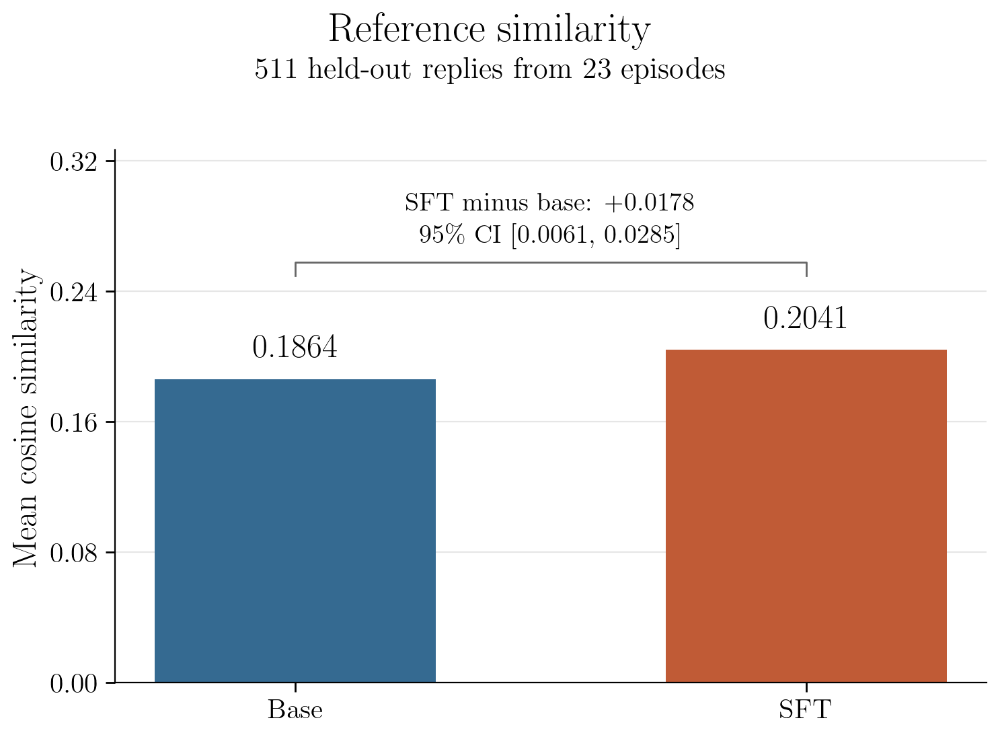
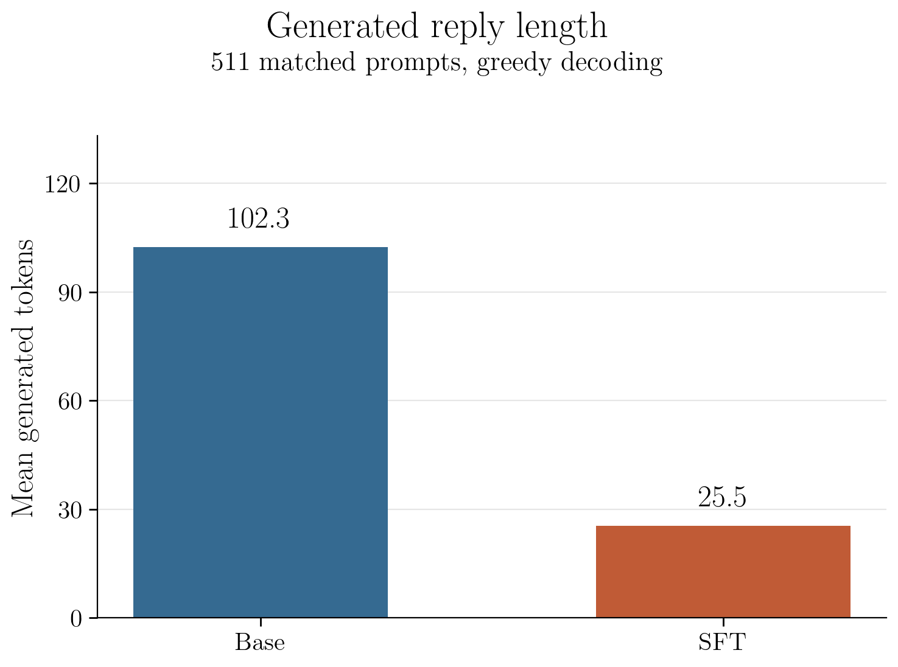
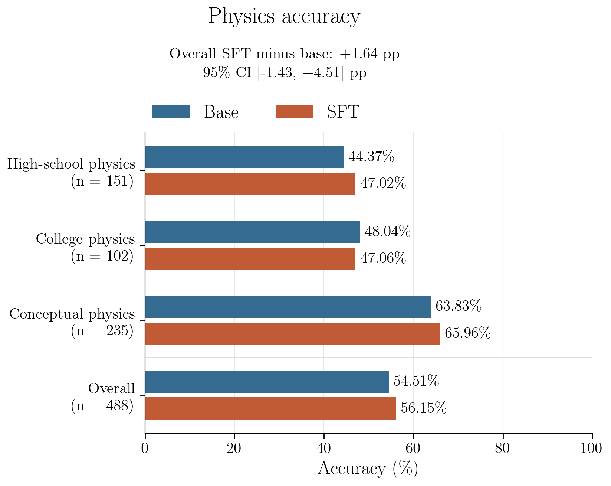

# Sheldon Cooper persona SFT

Post-training Qwen2.5-3B-Instruct to adopt a fictional persona, then measuring
what that does to its physics multiple-choice accuracy. This repo contains data
preparation, LoRA training, and paired persona and physics evaluations for
Checkpoint 1. The held-out transcript episodes are reserved for persona evaluation.

The STEM benchmark is MMLU physics, replacing the earlier GSM8K plan.

## Quick start

The transcripts are copyrighted TV dialogue and are **not in this repo**. You
rebuild them locally, which takes about five minutes, once:

```bash
pip install requests beautifulsoup4

python3 scrape_transcripts.py                          # ~5 min, 231 episodes
python3 build_pairs.py --seed 0 --min-target-words 10  # seconds
python3 validate_pairs.py                              # should end "all checks passed"
```

That produces `data/pairs_train.jsonl` and `data/pairs_heldout.jsonl`. Keep
`--seed 0` — it fixes which episodes are held out, so your split matches
everyone else's exactly.

## Training

The completed adapter is available in the
[Checkpoint 1 model release](https://github.com/ST3F4NX/aisafetyhw1/releases/tag/checkpoint-1-sft).
To reuse it without retraining:

```bash
mkdir -p out/releases
gh release download checkpoint-1-sft --repo ST3F4NX/aisafetyhw1 --pattern sft-lora.tar.gz --dir out/releases
tar -xzf out/releases/sft-lora.tar.gz -C out
```

The archive contains the adapter, tokenizer, training metadata, and loading
instructions. It recreates `out/sft-lora/`, which both evaluation scripts use.
The original base weights are downloaded separately at the pinned revision.
Built with Qwen. The model artifact includes the Qwen Research License and
required notices; its license permits research and evaluation use only.

Use Python 3.12 and one NVIDIA GPU with a compatible CUDA driver. Install the
dependencies in a virtual environment, then run:

```bash
python -m pip install -r requirements.txt
python train_sft.py --batch-size 8 --gradient-accumulation-steps 2
```

This command is intended for a 48 GB GPU and uses 16 examples per optimizer
update. The default run trains a rank-16 LoRA adapter for one epoch at a learning
rate of `1e-4`. Earlier conversation turns supply context; only the final assistant
reply contributes to the loss. The script checks the token masks and rejects
examples that would be truncated. It does not add a persona instruction.

`out/sft-lora/` contains the adapter, tokenizer, epoch checkpoints, training
metrics, and a run manifest with the base-model revision, dataset hash, package
versions, and settings. The adapter must be loaded with its original base model.
Existing output directories are protected against accidental overwrite. Use
`--output-dir` for another attempt or `--resume-from-checkpoint` with an epoch
checkpoint to resume an interrupted run. Run `python train_sft.py --help` for
the available training settings.

The full run on an A40 completed one epoch over all 4,899 examples: 307 optimizer
updates in 402.5 seconds, with training loss 2.6291. See `WORKLOG.md` for training
validation and artifact checks; persona and physics results are below.

## Persona evaluation

```bash
python eval_persona.py
```

This evaluates every held-out example. Both models receive the same preceding
conversation through the saved chat template, without a persona instruction or
any part of the final reference answer. Generation is greedy with a shared limit
of 256 new tokens. The base comparison disables the LoRA adapter on the same
frozen base weights; the SFT comparison enables it.

`sentence-transformers/all-mpnet-base-v2` embeds each generated reply and its
matching Sheldon reference. The script averages per-example cosine similarities
and reports the paired SFT-minus-base difference. Its 95% percentile bootstrap
interval resamples whole episodes, retaining their examples together. This
accounts for clustering within episodes, but not every possible source of bias.

The [embedding model](https://huggingface.co/sentence-transformers/all-mpnet-base-v2)
measures semantic reference similarity, not persona style directly.
Inspect saved paired outputs as well; a sensible alternative response can score
poorly against the single reference. Generation lengths, empty replies, token-limit
hits, and embedding truncation counts are reported to help interpret the scores.
Episode holdout prevents overlap with this fine-tuning dataset; it cannot establish
whether the base model encountered the show during pretraining.

`results/persona.json` contains scores and reproducibility metadata only.
`out/persona/` contains the private prompts, references, generated replies, and
per-example scores. Re-running the same command resumes completed generation
batches; changed settings require a new `--output-dir` and `--metrics-file`.
The embedding revision, model revision, adapter hash, and dataset hash are saved.
Resuming now also checks the adapter configuration; older runs without that hash
need a new output directory and metrics path.
Held-out perplexity and a separate style judgment are not implemented in this
evaluation script. Do not repeatedly tune against this held-out set and then
describe it as an untouched final test.

Completed results on 511 examples from 23 episodes:

| Metric | Base | SFT |
|---|---:|---:|
| Mean reference cosine similarity | 0.186364 | 0.204125 |
| Mean generated tokens | 102.33 | 25.46 |
| Replies reaching the 256-token limit | 38 | 12 |

The mean paired improvement is **0.017761**, with a 95% episode-bootstrap
interval of **[0.006107, 0.028523]**. Neither model produced empty replies, and
the embedding model truncated no texts. SFT scores higher on 56.36% of examples.
Qualitative inspection found repetitive replies that still improved this metric,
so these results do not establish strong persona quality. See `WORKLOG.md` for
validation, the exploratory length analysis, and remaining checkpoint work.

## Physics evaluation

```bash
python eval_mmlu.py --prepare-only
python eval_mmlu.py --device cuda --batch-size 16
```

This compares base and SFT accuracy on all test questions from the three physics
subjects in [MMLU](https://huggingface.co/datasets/cais/mmlu): high-school physics
(151), college physics (102), and conceptual physics (235), totaling **488**.
`eval/mmlu_physics.json` freezes the dataset revision and question indices.
`data/mmlu_physics.json` caches the questions locally; its hash is checked before
each run. No GSM8K test was run.

Both models receive the same five labeled examples from the corresponding
subject's development split, followed by the test question and four options.
The test answer is withheld. The conversation uses the model's chat template
and a shared instruction to answer with one letter, without a persona prompt.

The predicted answer is whichever of A/B/C/D has the highest next-token
probability. This is a constrained multiple-choice test, not free-form answer
generation. It does not require a generated-answer extractor. The script checks
that each label is one token and records both probabilities normalized over the
four letters and their total probability mass in the full vocabulary. The latter
helps reveal when the model would prefer to generate something other than a
letter. Conditional choice probabilities are not calibrated confidence scores.

The five-shot setup follows the development/test separation used by the
[original MMLU evaluator](https://github.com/hendrycks/test/blob/master/evaluate.py),
but uses a chat prompt rather than the original plain-text completion prompt.
Do not compare these numbers directly to leaderboard results with different
prompting or scoring protocols. This test measures physics answer selection,
not explanation quality or persona style.

The script reports accuracy by subject and overall, weighted by question count,
plus a paired SFT-minus-base accuracy difference and a 95% bootstrap interval
that resamples paired questions within each subject. Identical questions and
settings should be retained for future model stages. Test exposure during the
base model's pretraining cannot be ruled out.

`results/mmlu_physics.json` holds scores and run metadata;
`out/mmlu_physics/predictions.jsonl` holds individual choices and prompts.
The same command resumes completed question pairs. Changed settings or code
require new output and metrics paths. The command above is intended for a
dedicated NVIDIA GPU. Device selection without `--device` defaults to NVIDIA
CUDA, then Apple MPS, then CPU. A batch size of 2 is the script default for local
execution. The reported comparison ran entirely on an H100 with batch size 16.

Completed physics results:

| Subject | Questions | Base accuracy | SFT accuracy |
|---|---:|---:|---:|
| High-school physics | 151 | 44.37% (67) | 47.02% (71) |
| College physics | 102 | 48.04% (49) | 47.06% (48) |
| Conceptual physics | 235 | 63.83% (150) | 65.96% (155) |
| Overall | 488 | **54.51% (266)** | **56.15% (274)** |

The paired gain is **1.64 percentage points**, with a 95% stratified paired
bootstrap interval of **[-1.43, +4.51] percentage points**. This interval includes
zero, so the test does not establish a clear overall improvement or degradation.
There were 35 wrong-to-correct changes and 27 correct-to-wrong changes.
Both models' unrestricted top next token was an answer letter on all 488
questions. Mean total answer-letter probability mass was 0.999999 for base
and 0.998933 for SFT.

## Results plots

Each file contains one graph: reference similarity, reply length, or physics
accuracy. The annotations above similarity and accuracy bars give the paired
SFT-minus-base 95% bootstrap intervals, not intervals for individual bars.







Regenerate them from the tracked result JSON files, without downloading models or
datasets:

```bash
python -m pip install -r requirements-plots.txt
python plot_results.py
```

The script writes PNG and PDF versions with serif fonts and outward ticks. Add
`--usetex` to render text with LaTeX if a working LaTeX installation is available.

## What you get

| | examples | episodes |
|---|---|---|
| train | 4,899 | 208 |
| held out | 511 | 23 |

Median Sheldon response is 18 words. Source material is 231 episodes, 51,488
lines of dialogue, 11,608 of them his.

## Data format

One JSON object per line. Each line is one independent training example:

```json
{"messages": [
   {"role": "user",      "content": "<something another character says>"},
   {"role": "assistant", "content": "<Sheldon's reply>"},
   {"role": "user",      "content": "<the other character again>"},
   {"role": "assistant", "content": "<the line we train on>"}
 ],
 "meta": {"episode": "...", "scene": 4, "target_words": 14}}
```

Everyone who isn't Sheldon becomes `user`; Sheldon becomes `assistant`.
Consecutive lines from the same side are merged, because the model has no notion
of separate speakers. **Only the final `assistant` message is a training
target** — earlier turns are context the model reads but isn't graded on.

About a third of examples have just two messages, where Sheldon spoke early in a
scene and there wasn't much before him to use. Context never crosses a scene
boundary, since dialogue from another scene isn't really context.

`meta` is bookkeeping for us and is not fed to the model.

## Decisions worth knowing about

**The split is by episode, not by row.** Sitcoms reuse jokes and beats, so
splitting individual lines at random risks putting near-copies on both sides and
inflating the held-out score. Whole-episode splitting prevents shared episodes,
though jokes or dialogue can still recur across episodes.

**Minimum response length is 10 words.** About 44% of Sheldon's raw lines fall
below this cutoff. The filter aims to reduce the risk of teaching consistently clipped
replies; whether short targets hurt worked-answer generation has not been tested.
Ten words keeps the mean at 22 while retaining ~50% more data than the original
15-word floor.

**Only lines attributed exactly to "Sheldon" are used.** The transcripts also
contain `Past Sheldon` (66 lines) and `Sheldon-bot` (39) — deliberately excluded,
since those are different voice registers. Total loss to name variants is under
1%.

**No system prompt in the training data.** The persona is supposed to end up in
the weights, not in the context window; putting it in the prompt would make the
comparison against base Qwen unfair.
The saved Qwen chat template still inserts its generic helpful-assistant system
message, consistently in training and persona evaluation.

## What's deliberately not here yet

CLAUDE.md describes two generated data sources — general conversation in the
persona's voice, and STEM examples with the arithmetic masked out of the loss.
**Both are deferred on purpose.** We're training on real transcript dialogue
first to find out what that alone achieves, so the generated data can be measured
as a delta against a real baseline rather than bundled in from the start.

Technical questions may be a weak spot: the transcript pairs include questions,
but primarily contain sitcom conversation rather than worked math solutions.
Held-out transcript evaluation measures the same conversational setting; MMLU
physics tests behavior on a different kind of input.

## Known limitations

- The filter that drops visually-dependent lines (ones that only make sense with
  a picture) matches a short hardcoded list of phrases, so it under-catches. Some
  lines referencing unseen objects survive into the data and become unanswerable
  prompts at eval time.
- Pairs are built from adjacent dialogue, so a reply responding to physical
  action rather than to the previous line will look like a non-sequitur.
- The physics evaluation uses multiple-choice selection; it does not test
  whether the model can produce a coherent worked physics solution.
- Only scores-only persona and physics results and their generated plots are
  tracked under `results/`. Transcript-derived outputs remain local under
  `out/persona/`.

## Files

```
scrape_transcripts.py   transcripts -> data/raw_episodes.json
build_pairs.py          episodes -> train/heldout chat pairs
validate_pairs.py       fails loudly if the pairs are unusable
train_sft.py            train pairs -> LoRA adapter and training logs
eval_persona.py         held-out pairs + adapter -> paired semantic similarity
eval_mmlu.py            MMLU physics questions + adapter -> paired accuracy
plot_results.py         saved result scores -> results/plots/
eval/mmlu_physics.json  frozen dataset revision and evaluation question indices
WORKLOG.md              completed runs, validation, and remaining work
requirements.txt        pinned direct dependencies
requirements-plots.txt  lightweight plotting dependency
data/                   gitignored, rebuild locally
```

Transcript source: https://bigbangtrans.wordpress.com/ — a fan transcription
site. Dialogue is copyrighted by its owners and is used here only locally, for a
course assignment.
